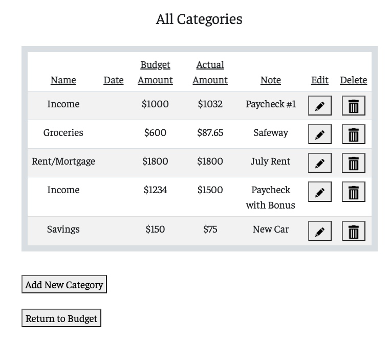

# My Money, My Problems :moneybag:

**Brand Statement**: Empowering individuals to take control of their finances and achieve their financial goals.

**Mission**: Our mission is to provide a comprehensive and user-friendly budgeting app that simplifies the process of tracking and managing finances.

**Target Market**: Our target market consists of individuals who need financial guidance and feel overwhelmed by the plethora of existing personal finance sources and websites. These individuals may be struggling with budgeting, organizing their expenses, or understanding complex financial concepts. They seek a solution that offers simplicity, accessibility, and personalized support to help them gain confidence in managing their finances effectively.

By understanding their challenges and frustrations, we aim to serve individuals from various age groups and backgrounds who are motivated to improve their financial well-being. Whether they are recent college graduates, young professionals, parents, or individuals nearing retirement, our app caters to a wide range of users who are seeking a trusted and user-friendly platform to enhance their financial literacy and achieve their financial goals.

---

## Link to App :link:
[My Money, My Problems](https://my-money-my-problems-adc02cdb74c3.herokuapp.com/)

---

## Home Page 

---
## Signed In
 - After signing up or logging in with their Google account, Users can then access their budgets.

---
## Budget Overview

---
## Categories Overview

---
## Technologies Used
 
 
 
  
 
 
 
 
  
 
 
 
---

## Future Enhancements
   - [ ] Full CRUD operation for different types of budgets
   - [ ] Implement Finance APIs that links the User's banking and investment accounts to their profile
   - [ ] Convert budgets to different currency values
   - [ ] Refer to Trello for all other enhancements: [Trello](https://trello.com/b/NApXZZXE/budget-app-men-full-stack-crud)
---